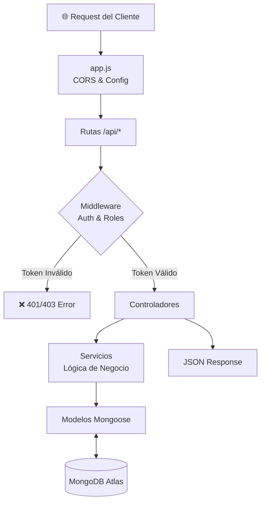

# 🍕 Cosa Nostra — Backend API


> API RESTful y lógica de servidor para el sistema de gestión gastronómica **Cosa Nostra**. Construida con Node.js, Express y MongoDB, provee servicios seguros de autenticación, gestión de reservas y métricas en tiempo real.

🔗 **Base URL (Producción):** `https://backend-restaurante-sigma.vercel.app`  
🔗 **Repositorio Frontend:** [Enlace al repo de Facundo]

---

## 📋 Tabla de Contenidos

- [Características](#-características)
- [Stack Tecnológico](#-stack-tecnológico)
- [Arquitectura y Flujo](#-arquitectura-y-flujo)
- [Decisiones de Diseño](#-decisiones-de-diseño)
- [Estructura del Proyecto](#-estructura-del-proyecto)
- [Instalación y Configuración](#-instalación-y-configuración)
- [Endpoints de la API](#-endpoints-de-la-api)
- [Roles y Permisos](#-roles-y-permisos)
- [Desafíos Técnicos Superados](#-desafíos-técnicos-superados)
- [Deploy en Vercel](#-deploy-en-vercel)
- [Contribución](#-contribución)
- [Equipo](#-equipo)

---

## ✨ Características

- 🔐 **Autenticación y Autorización** — Emisión y validación de JSON Web Tokens (JWT) con encriptación de contraseñas (Bcrypt).
- 📅 **Motor de Reservas** — Lógica de validación de disponibilidad, control de fechas y estados de reserva.
- 📊 **Agregación de Datos** — Consultas complejas a MongoDB para generar estadísticas del Dashboard (horas pico, tendencias).
- 🛡️ **Seguridad Integral** — Middlewares de protección de rutas, validación de roles y control de CORS estricto.
- ☁️ **Optimización Serverless** — Arquitectura adaptada para cold-starts eficientes en Vercel.

---

## 🛠️ Stack Tecnológico

| Tecnología | Uso |
|---|---|
| [Node.js](https://nodejs.org/) | Entorno de ejecución |
| [Express.js](https://expressjs.com/) | Framework web y enrutamiento |
| [MongoDB Atlas](https://www.mongodb.com/) | Base de datos NoSQL en la nube |
| [Mongoose](https://mongoosejs.com/) | ODM para modelado de datos |
| [JWT](https://jwt.io/) | Estándar de seguridad para tokens |

---

## 🏗️ Arquitectura y Flujo

El backend sigue una arquitectura en capas, separando responsabilidades para facilitar el testing y la escalabilidad.



## 🧩 Decisiones de Diseño

| Decisión | Alternativa considerada | Por qué elegimos esta opción |
|---|---|---|
| **Arquitectura Modular (Feature-based)** | MVC Tradicional | Agrupar por dominio (Auth, Users, Reservations) facilita encontrar el código y escalar el equipo. |
| **Punto de Entrada en `app.js`** | `index.js` único | Separar la lógica de la app (`app.js`) de la inicialización del puerto (`index.js`) es vital para entornos Serverless como Vercel. |
| **CORS Manual (Middleware)** | Librería `cors` de npm | La librería estándar bloqueaba las peticiones preflight (`OPTIONS`) en Vercel. Implementarlo a mano garantizó el control total de los headers. |
| **MongoDB (NoSQL)** | PostgreSQL / SQL | Los documentos JSON se mapean perfectamente con los estados y datos flexibles de una reserva de restaurante. |

---

## 📁 Estructura del Proyecto

```text
src/
├── config/              # Configuración de la base de datos (db.js)
├── middlewares/         # Interceptores: Autenticación, Roles y Manejo de Errores
├── modules/             # Arquitectura modular por dominio
│   ├── auth/            # Controladores, rutas, servicios y validación de Auth
│   ├── reservations/    # CRUD completo, modelos y lógica de reservas
│   └── users/           # Lógica de negocio y modelos de usuarios
├── shared/              # Utilidades: Clases de error (AppError) y validadores genéricos
├── app.js               # Configuración de Express, Middlewares y CORS (Punto de entrada Vercel)
└── index.js             # Inicialización del servidor para entorno de desarrollo local
